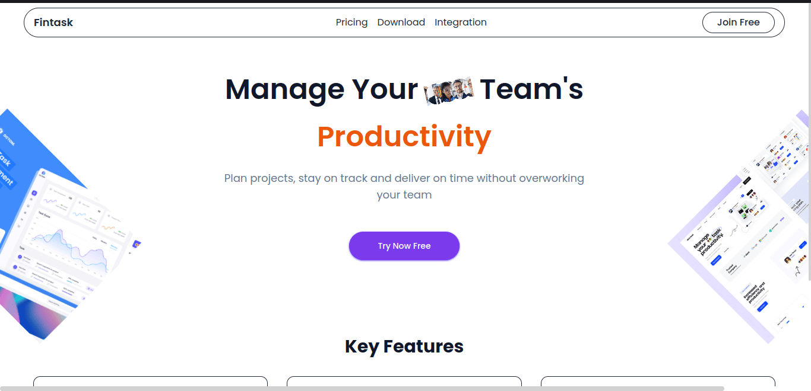
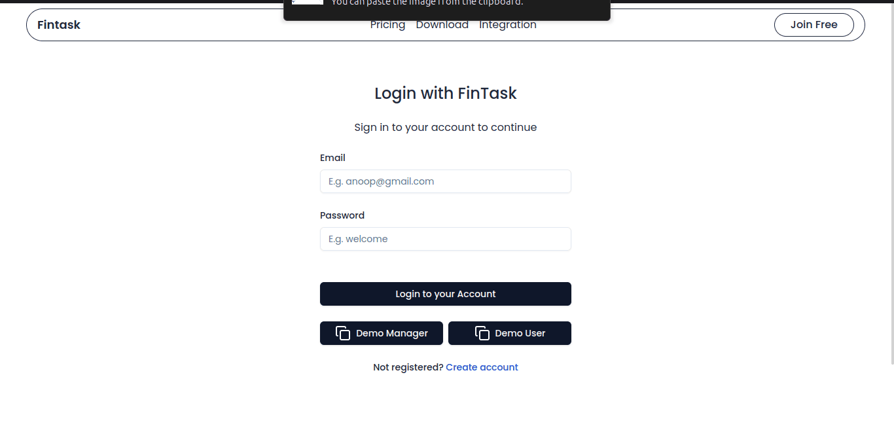
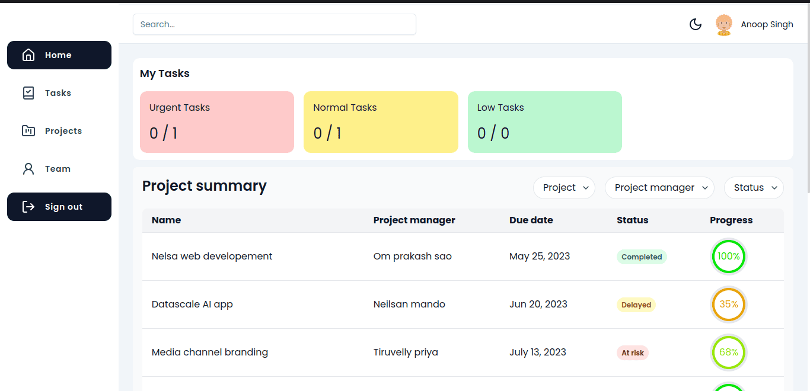
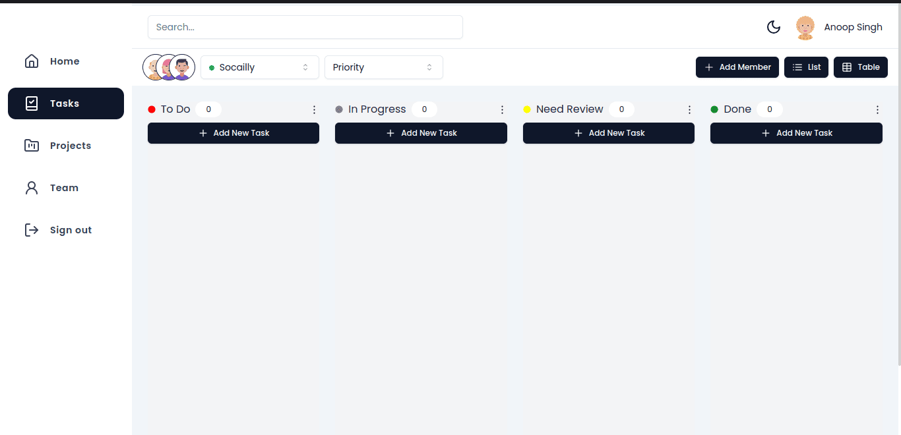
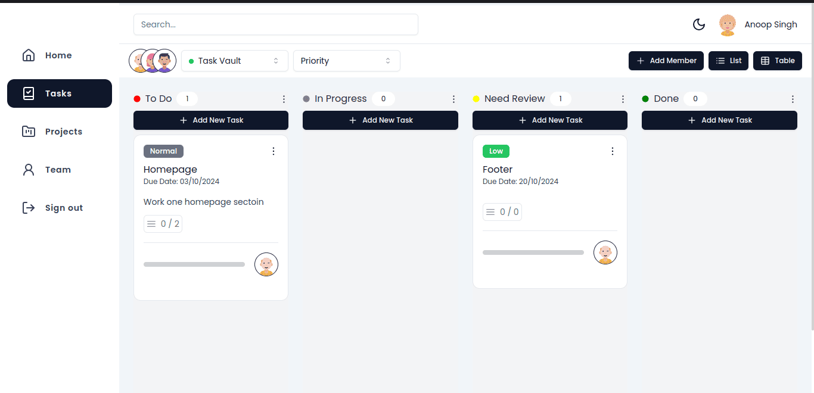
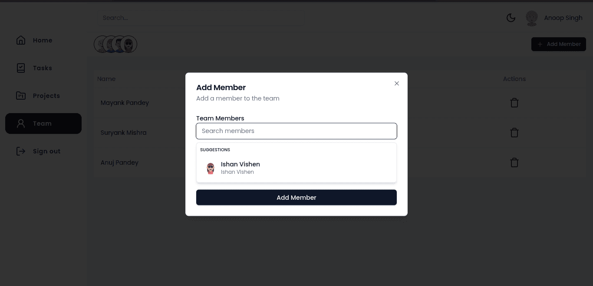
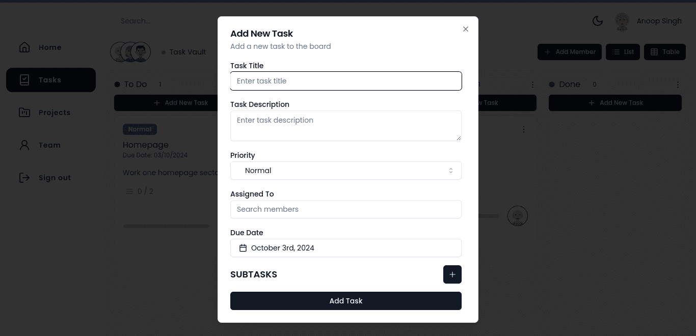
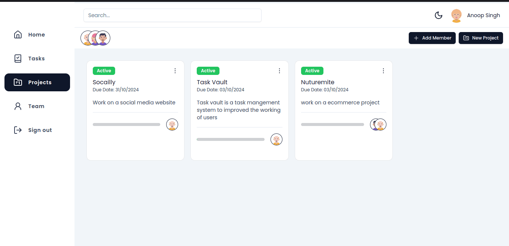

# Task Management Website

**Task Management Website** is a platform designed for efficient project and task management. It allows administrators to create teams, assign projects and tasks, and manage team members’ workloads. Built with Node.js, Express, and MongoDB, it provides a user-friendly interface for managing tasks and projects.

## Tech Stack

- **Backend:** Node.js, Express
- **Frontend:** Next.js, Shadcn , SWR
- **Database:** MongoDB

## Features

- **Admin Dashboard:**  
  Manage projects, tasks, and teams from a centralized dashboard.

- **Project Management:**  
  Create, update, and delete projects. Assign team members to projects.

- **Task Management:**  
  Create tasks within projects, assign them to team members, and update their statuses.

- **Team Management:**  
  Create teams, add or remove members, and assign roles.

- **Task Tracking:**  
  View and update task progress and due dates.

# Task Management Website

|  |  |
|--------------------------------|--------------------------------|
|  |  |
|  |  |
|  |  |

## Installation

### Backend

1. Clone the repository.
2. Install dependencies: `pnpm install` or `yarn install`.
3. Set up your MongoDB database.
4. Update your `.env` file with your database credentials.
5. Start the server using `pnpm start` or `yarn start`.

### Frontend

1. Clone the repository (if applicable).
2. Install dependencies: `pnpm install` or `yarn install`.
3. Start the development server: `pnpm run dev` or `yarn dev`.

## API Endpoints

### Projects

| Method | Endpoint        | Description                     |
| ------ | ----------------| --------------------------------|
| POST   | /projects       | Create a new project           |
| GET    | /projects       | Get all projects               |
| PUT    | /projects/:id   | Update a specific project      |
| DELETE | /projects/:id   | Delete a specific project      |

### Tasks

| Method | Endpoint        | Description                     |
| ------ | ----------------| --------------------------------|
| POST   | /tasks          | Create a new task              |
| GET    | /tasks          | Get all tasks                  |
| PUT    | /tasks/:id      | Update a specific task         |
| DELETE | /tasks/:id      | Delete a specific task         |

### Teams

| Method | Endpoint        | Description                     |
| ------ | ----------------| --------------------------------|
| POST   | /teams          | Create a new team              |
| GET    | /teams          | Get all teams                  |
| PUT    | /teams/:id      | Update a specific team         |
| DELETE | /teams/:id      | Delete a specific team         |

## Database Schema

### Users

| Column    | Type      |
| --------- | --------- |
| id        | serial    |
| name      | String    |
| email     | String    |
| password  | String    |
| role      | String    |
| createdAt | Date      |
| updatedAt | Date      |

### Projects

| Column    | Type      |
| --------- | --------- |
| id        | serial    |
| title     | String    |
| desc      | String    |
| manager   | ObjectId  |
| members   | [ObjectId]|
| status    | String    |
| progress   | Number    |
| dueDate   | Date      |

### Tasks

| Column    | Type      |
| --------- | --------- |
| id        | serial    |
| project   | ObjectId  |
| assignee  | ObjectId  |
| title     | String    |
| desc      | String    |
| priority  | String    |
| status    | String    |
| progress  | Number    |
| dueDate   | Date      |
| subTasks  | [subTask] |

### SubTasks

| Column    | Type      |
| --------- | --------- |
| id        | serial    |
| title     | String    |
| desc      | String    |
| status    | String    |

## Contributing

Feel free to submit issues or pull requests for any improvements or bug fixes.

## License

This project is licensed under the MIT License.
